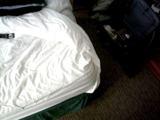
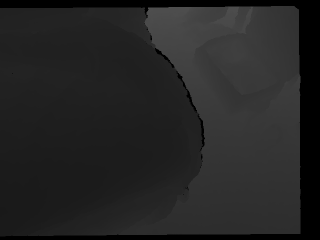

【SLAM】三角测量&深度估计
===

【写在前面】
---
① 本项目为小白本白的视觉SLAM入门  
② 知识来源于，emmm，经典书目，《视觉SLAM十四讲 从理论到实践》  
链接：https://pan.baidu.com/s/1s_l1jkRH3vFEoY9S8ni2Sg?pwd=jc4a   
提取码：jc4a   
③ 本项目旨在利用传统的三角测量和Deltas论文中提出的算法估计 Portland_hotel 数据集中图像对应的深度，并定量对比其Abs、RMSE、RMSE log指标，其中传统三角测量方法分别使用 SURF、SIFT、ORB这3种不同的特征点检测方法并进行对比，Deltas算法是指论文《DELTAS Depth Estimation by Learning Triangulation And densification of Sparse points, ECCV2020》中的方法。  

【数据集样式】
---
① RGB图像  

  

② 深度图像  

   

【实验环境】
---
① 传统算法的实验环境为：  
ubuntu 20.04, opencv 3.4.15, opencv_contrib 3.4.15 cmake 3.16.3  
② Deltas算法的实验环境为：  
AutoDL- RTX3080 pytorch1.8.1+cu111 opencv-python 4.7.0.12 python3.8.10  

【Tips】
---
① 本项目中传统算法实现的实验环境为ubuntu，这是因为slambook提供的实验代码就是适合在ubuntu环境下执行的代码，但是！  
但是！配环境巨坑！如果再来一次，从运行代码辅助知识理解的角度出发，我会用python环境平替ubuntu，然后利用ChatGPT把c++源码转成python。
但是！如果实际工程项目，还是C++哦。  
② Deltas算法配环境倒是没什么坑，老样子，我当时还是在Autodl上租的机子。  
如果您配环境遇到问题，可以：  
1. 注册一个autodl账号，按需租用GPU算力 ***【非广告】***  
2. email: 1687107467@qq.com  
邮件主题：autodl-SLAM三角测量&深度估计-镜像共享  
邮件内容：您的autodl账号id

【】
